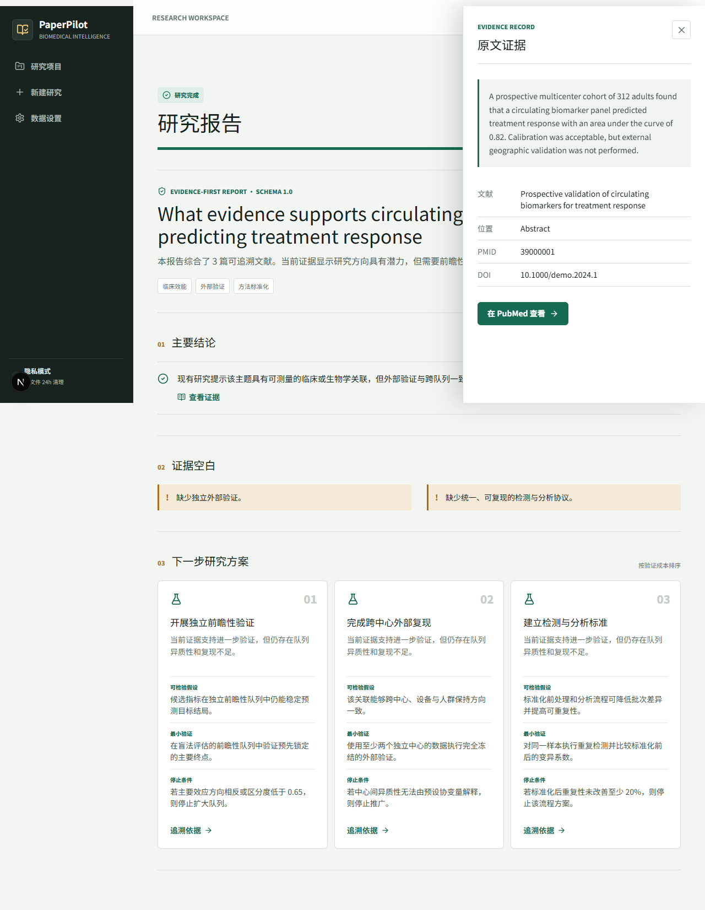
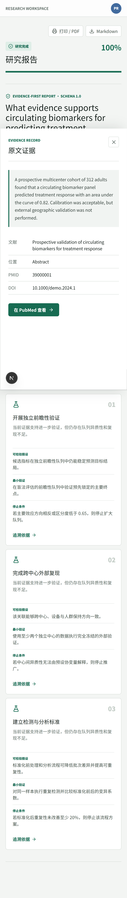

# PaperPilot

PaperPilot is an evidence-first biomedical research intelligence workspace for individual researchers. It turns a structured research question and optional private PDFs into an auditable progress report, evidence records, research gaps, and three testable next-step proposals.

## Interface preview

### Evidence-linked report

The desktop report keeps claims, research gaps, three next-step proposals, and the supporting Evidence Record in one auditable workspace.



### Responsive report reader

The same evidence workflow adapts to mobile screens with a fixed bottom navigation and a full-width evidence drawer.

<p align="center">
  
</p>

## Local development

Prerequisites: Python 3.10+, Node.js 22+, npm, and `uv`.

```powershell
uv venv .venv --python 3.10
uv pip install --python .venv\Scripts\python.exe -e "services/api[dev]"
npm install
```

Start the API in one terminal:

```powershell
$env:PYTHONPATH = "services/api/src"
.\.venv\Scripts\python.exe -m uvicorn paperpilot.api.app:app --reload --port 8000
```

Start the web app in another terminal:

```powershell
npm run dev
```

Open `http://localhost:3000`. Demo mode uses an offline literature fixture and a deterministic evidence report, so no API keys are required.

## DeepSeek synthesis

Live research runs use DeepSeek for evidence-grounded report synthesis. Disable demo mode and
provide the API key before starting the API. Install the declared API dependencies first:

```powershell
cd E:\Project\PaperPilot
uv pip install --python .venv\Scripts\python.exe -e "services/api[dev]"
```

Start the DeepSeek-enabled API on port `8010` in one PowerShell terminal:

```powershell
$env:PAPERPILOT_DEMO_MODE = "false"
$env:PAPERPILOT_LOCAL_AUTH_ENABLED = "true"
$env:PAPERPILOT_DEEPSEEK_API_KEY = "your-api-key"
$env:PAPERPILOT_DEEPSEEK_MODEL = "deepseek-v4-pro"
$env:PYTHONPATH = "services/api/src"

.\.venv\Scripts\python.exe -m uvicorn paperpilot.api.app:app --reload --host 127.0.0.1 --port 8010
```

Start the web app in another PowerShell terminal and point it to the same API port:

```powershell
$env:NEXT_PUBLIC_API_URL = "http://localhost:8010"
npm run dev
```

Open `http://localhost:3000` and use `http://localhost:8010/docs` for the API documentation. If
port `3000` is already occupied by an older PaperPilot process, stop that process before restarting
the web app so the new `NEXT_PUBLIC_API_URL` takes effect.

The defaults are `https://api.deepseek.com` and `deepseek-v4-pro`, with high reasoning effort and
thinking enabled. Set
`PAPERPILOT_DEEPSEEK_BASE_URL` to route requests through a compliant enterprise gateway. Confirm
that the selected service contract prohibits training on and retention of customer data before
using private research material. PowerShell `$env:` values apply only to the current terminal; do
not commit a real API key to the repository.

## Full container stack

```bash
docker compose up --build
```

Enable GROBID full-text parsing with `docker compose --profile fulltext up --build`. Before any public deployment, change `PAPERPILOT_AUTH_SECRET`, disable demo mode, configure an enterprise model endpoint, and switch storage to OSS.

## Verification

```powershell
cd services/api
..\..\.venv\Scripts\python.exe -m pytest -q
..\..\.venv\Scripts\ruff.exe check src tests
cd ..\..
npm test
npm run build
```

Architecture and privacy details are in [docs/architecture.md](docs/architecture.md) and [docs/privacy.md](docs/privacy.md). The initial quality benchmark is under [evaluation](evaluation/README.md).
